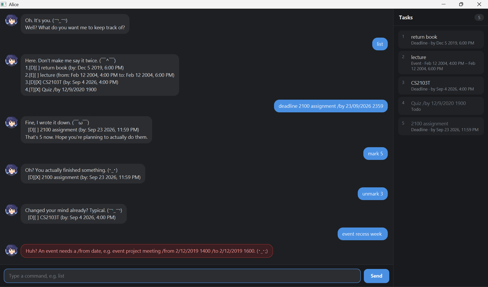

# Alice

Alice is a task manager for people who would rather type than click. She keeps
track of your todos, deadlines and events, remembers them between runs, and is
faintly put out about having to do any of it.



She is not especially gracious about it - the replies below are verbatim -
but every message still tells you exactly what happened.

Everything is driven by typed commands. The conversation is on the left; the
panel on the right always shows your current task list, so you never have to
ask what is on it.

## Contents

* [Getting started](#getting-started)
* [Adding a todo](#adding-a-todo-todo)
* [Adding a deadline](#adding-a-deadline-deadline)
* [Adding an event](#adding-an-event-event)
* [Listing your tasks](#listing-your-tasks-list)
* [Marking a task done](#marking-a-task-done-mark--unmark)
* [Postponing a deadline](#postponing-a-deadline-snooze)
* [Searching](#searching-find)
* [Deleting a task](#deleting-a-task-delete)
* [Exiting](#exiting-bye)
* [Saving your data](#saving-your-data)
* [Command summary](#command-summary)

## Getting started

1. Make sure you have **Java 25** installed.
1. Download `alice.jar` from the releases page.
1. Put it in the folder you want Alice to keep her data in, and run it:
   ```
   java -jar alice.jar
   ```
1. Type a command into the box at the bottom and press Enter, or click `Send`.

Dates are always written as `d/M/yyyy HHmm` - day, month, year, then a 24-hour
time. So `23/9/2026 2359` means the 23rd of September 2026 at 11:59 pm.

## Adding a todo: `todo`

Adds a task with no date attached.

Format: `todo DESCRIPTION`

Example: `todo read book`

```
Fine, I wrote it down. (￣ω￣)
  [T][ ] read book
That's 1 now. Hope you're planning to actually do them.
```

## Adding a deadline: `deadline`

Adds a task that has to be finished by a particular time.

Format: `deadline DESCRIPTION /by d/M/yyyy HHmm`

Example: `deadline return book /by 2/12/2019 1800`

```
Fine, I wrote it down. (￣ω￣)
  [D][ ] return book (by: Dec 2 2019, 6:00 PM)
That's 1 now. Hope you're planning to actually do them.
```

## Adding an event: `event`

Adds a task that runs from one time to another. The `/from` must come before
the `/to`, and an event cannot end before it starts.

Format: `event DESCRIPTION /from d/M/yyyy HHmm /to d/M/yyyy HHmm`

Example: `event project meeting /from 2/12/2019 1400 /to 2/12/2019 1600`

```
Fine, I wrote it down. (￣ω￣)
  [E][ ] project meeting (from: Dec 2 2019, 2:00 PM to: Dec 2 2019, 4:00 PM)
That's 1 now. Hope you're planning to actually do them.
```

## Listing your tasks: `list`

Shows every task, numbered. Those numbers are what the other commands take.

Format: `list`

```
Here. Don't make me say it twice. (￣^￣)
1.[T][ ] read book
2.[D][ ] essay (by: Sep 23 2026, 11:59 PM)
```

The markers tell you the type and whether it is done: `[T]` todo, `[D]`
deadline, `[E]` event, and `[X]` in place of a blank means finished.

## Marking a task done: `mark` / `unmark`

Format: `mark TASK_NUMBER` and `unmark TASK_NUMBER`

Example: `mark 1`

```
Oh? You actually finished something. (・_・)
  [T][X] read book
```

Example: `unmark 1`

```
Changed your mind already? Typical. (￢_￢)
  [T][ ] read book
```

## Postponing a deadline: `snooze`

Pushes a deadline back by a number of days. Only deadlines can be snoozed, and
only ones you have not already finished.

Format: `snooze TASK_NUMBER DAYS`

Example: `snooze 1 3`

```
Putting it off again, are we? ...Fine. (；一_一)
  [D][ ] essay (by: Sep 26 2026, 11:59 PM)
```

## Searching: `find`

Shows the tasks whose description contains any of the words you give. The match
is case-sensitive, and it matches part-words too, so `ookshe` finds
`bookshelf`.

Format: `find KEYWORD [MORE_KEYWORDS]`

Example: `find book`

```
These matched. You're welcome, by the way. (￣ω￣)
1.[T][ ] read book
```

## Deleting a task: `delete`

Format: `delete TASK_NUMBER`

Example: `delete 2`

```
Gone. Not that it matters to me. (￣_￣)
  [T][ ] read book
1 left.
```

## Exiting: `bye`

Format: `bye`

```
Finally. Go on then. (￣^￣)
...Don't miss your deadlines. Not that I'd care.
```

The window closes a moment later, so you can read the message first.

## Saving your data

Alice saves to `data/alice.txt` after every command that changes anything, and
reloads it when she starts. There is no save command; it just happens.

If she cannot write the file, she says so instead of pretending the change was
saved, so you will know your work is at risk rather than finding out later. If
a line in the file cannot be read - because it was hand-edited, say - she skips
that line, keeps the rest, and tells you which one she skipped.

## When you get something wrong

Alice rejects commands she does not understand rather than storing them, so a
typo will not quietly become a task. Errors appear in a red-bordered bubble and
always say what was wrong:

```
Huh? I don't know the command 'lsit'. (・_・;)
Try one of: todo, deadline, event, list, find, mark, unmark, delete, snooze, bye.
```

```
Huh? mark needs a task number, e.g. mark 2. (・_・;)
```

```
Huh? An event cannot end before it starts. (・_・;)
```

## Command summary

| Action | Format | Example |
|---|---|---|
| Add todo | `todo DESCRIPTION` | `todo read book` |
| Add deadline | `deadline DESCRIPTION /by d/M/yyyy HHmm` | `deadline essay /by 23/9/2026 2359` |
| Add event | `event DESCRIPTION /from d/M/yyyy HHmm /to d/M/yyyy HHmm` | `event meeting /from 2/12/2019 1400 /to 2/12/2019 1600` |
| List | `list` | `list` |
| Mark done | `mark TASK_NUMBER` | `mark 1` |
| Mark not done | `unmark TASK_NUMBER` | `unmark 1` |
| Postpone deadline | `snooze TASK_NUMBER DAYS` | `snooze 1 3` |
| Find | `find KEYWORD [MORE_KEYWORDS]` | `find book essay` |
| Delete | `delete TASK_NUMBER` | `delete 2` |
| Exit | `bye` | `bye` |
